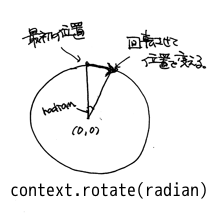
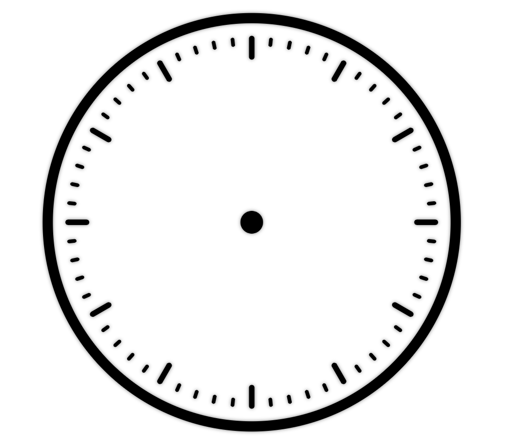

==============================
文字盤を描画しよう。
==============================

土台となる文字盤を描画しましょう。SampleClockでは文字盤と時刻を示す“針”をそれぞれ別の要素へ描画します。

外枠を描画する
==============================

文字盤の外枠を描画してみましょう。描画を行う *canvas* 要素は文字盤用の **board** の方です。原点は既に *canvas* の中央に移動しているので特に数値をいじる必要はありません。半径は **SampleClock.radius()** をそのまま使うと余裕というか余白がありませんので、長さを1割り減くらいにしておきましょう。始まりのラジアンは0で、一周クルっと円を描くつもりですから終わりのラジアンは2π。弧を描く方向はどちらでもいいので省略しましょう。

.. code-block:: javascript

 SampleClock.prototype = {
     ...
     draw_board: function () {
         this.boardContext.beginPath();
         this.boardContext.lineWidth = this.radius() * 0.05;
         this.boardContext.arc(0, 0, this.radius() * 0.9, 0, Math.PI * 2);
         this.boardContext.stroke();
     },
     ...
 }

文字盤を描画するメソッド **draw_board()** 内に実装します。まず始まりはお決まりの **context.beginPath()** です。それからサブパスを定義していきます。次の **context.lineWidth** 属性は文字の太さです。外枠ですから少し太めの線にしましょうか。直接数値を渡してもいいのですけど、SampleClockはブラウザの表示領域に合わせて描画する仕様ですので、 **SampleClock.radius()** に割合を掛け合わせたものにしましょう。今後も太さや大きさは **SampleClock.radius()** の値を基準に設定していくといいと思いますよ。最後に忘れずに **context.stroke()** を呼び出して、これまでのパスの内容を描画させます。

さぁ、描けました。 *Canvas* での初描画です！（人により違う）

“時”を標す
==============================

外枠ができたので今度は内側に時間だの分だのの目盛りを付けましょう。わかりやすくするために、“時”を示す目盛りは少し長めに、“分”、“秒”を示す目盛りは少し短めに描画しましょうか。描画する位置は外枠よりもまた少し内側にします。これは好みですのでどうでもいいですが。

まずは“時”の印を描画します。一周360度で12時間を刻むので、 ::

 360 / 12 = 30

30度おきに目盛りを入れていけばよさそうです。やり方はこうです。まず **context.moveTo(x, y)** メソッドで描き始めの頂点を指定しますが、その時のxの値を外枠よりもちょっと内側の値にします。外枠のときの半径を **SampleClock.radius() * 0.9** としたので、それより内側にするために **SampleClock.radius() * 0.85** としましょう。次に **context.LineTo(x, y)** メソッドでそこから少しだけ内側に向かって線をひきます。さらに内側へ向かうのでxの値は **SampleClock.radius() * 0.75** にしましょうか。最後に **canvas** の座標レイヤーを回転します。そしてまた書き始めの頂点を指定します。それを一周分、12時間分繰り返せば奇麗に埋まるはずです。

*canvas* の座標レイヤーの回転には **context.rotate(radian)** メソッドを使います。引数はもちろんラジアンでの値を渡します。

.. code-block:: javascript

 SampleClock.prototype = {
     ....
     draw_board: function () {
         ...
         this.boardContext.beginPath();
         this.boardContext.lineWidth = this.radius() * 0.03;
         for (var i = 0; i < 12; i++) {
             this.boardContext.moveTo(this.radius() * 0.85, 0);
             this.boardContext.lineTo(this.radius() * 0.75, 0);
             this.boardContext.rotate(this.toRad(360 / 12));
         }
         this.boardContext.stroke();
         ...
     },
     ...
 }

まずは何はなくとも **context.beginPath()** 、これから始まります。線の太さを少し細くして、 **forループ** を使って12回描画して回転する処理を繰り返します。そして最後の **context.stroke()** 。問題ありませんよね。

“分”を標す
==============================

“時”の目盛りを入れたので、今度は“分”、“秒”の目盛りを入れましょう。やり方は“時”のときとほとんど同じで、12分割だったものが60分割になるだけです。ただし、“時”の目盛りと重なる部分は必要ないので描画しない方がいいでしょう。

“時”のときのプログラム例を参考に実装してみてください。

こんな感じになりますよ。

.. warning::

 本当はちょっと小細工しているので同じにはなりません :-) 線の端を丸くしてます。
