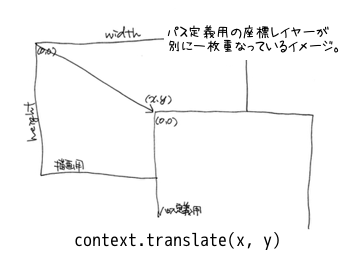

==============================
Canvasってなんだろう。
==============================

SampleClockでは画像ファイルを使わずに *Canvas* を使って時計を描画します。ここでは *Canvas* を説明しつつ、実際にSampleClockの作成も少しずつやっていきますよ。

Canvasとは
==============================

*Canvas* とは、 *JavaScript* を用いてプログラマブルに画像を描画する *Web* 用の技術で *HTML5* にも含まれます。狭義に *Canvas* は要素の事でcanvas要素に描画する *API* は *HTML Canvas 2D Context* という別の仕様になりますが、広義には両方を含めて示されます。

.. note::

 * `4.8.11 The canvas element — HTML5 <http://www.w3.org/TR/html5/the-canvas-element.html#the-canvas-element>`_
 * `HTML Canvas 2D Context <http://www.w3.org/TR/2dcontext/>`_

 それぞれ上記の場所で仕様が纏められています。ご存知のように *HTML5* の類いは未だに Working Draft の状態ですので、今後も変更される可能性があります。

 「2D Contextがあるのなら3Dも」と私なんかは思ってしまうのですが存在しません。 *canvas* 要素を使う事は共通ですが、3次元画像用のAPIは *WebGL* という名前で定義されています。

 *Canvas* は *Apple* 由来の技術で同社は関連する特許も保有していましたが、今は *W3C* の特許条項に従う形で解放されています。

パスを用いて描画するだけでなく画像ファイルを読み込んで使用したり、フォントを利用して文字列を描画する事もできます。描画される画像は一見するとベクターイメージですが、実際はビットマップイメージでピクセル操作が可能です。

.. note::

 ベクターイメージを扱うWebの技術としては *SVG* があります。こちらは *Canvas* よりもずっと古くからある技術です。当時は別途プラグインが必要だったりしてあまり普及しませんでした。

*Safari* 1.3以降、 *Opera* 9以降、 *Firefox* 1.5以降、 *Google Chrome* と、最近のものであればほぼ全てのブラウザで実装されていますが、 *Internet Explorer* は9以降のバージョンでしか使えません。しかし、IE 6以降で使える `ExplorerCanvas <http://excanvas.sourceforge.net/>`_ というライブラリが *Google* から公開されています。

.. warning::

 *VMware Fusion* で動かしている *Windows xp* 上の *Internet Explorer*  8にて試してみましたが、上記の *ExplorerCanvas* を使用してもSampleClockは動きませんでした。残念です……。

*Canvas* は図形を描画したり画像ファイルを読み込み変更を加えて表示したりできますが、一度描画した後はどうする事もできません。一切動かす事もできません。つまり *Flash* のようにアニメーションさせる事は不可能なのですが、少しずつ変更を加えて描画を繰り返す事によりアニメーションさせる事はできます。

今回作るSampleClockもそうした原理で動いているように見せているアプリケーションです。今日のCPUパワーがそれを実現させたとも言えますね。

widthとheight
==============================

*Canvas* 要素は **width** と **height** 、横幅と縦幅の属性を持ちます。これらの値を設定する事で描画領域を調整する事ができます。今回はブラウザの表示領域を最大限利用したいので、それらの値を取得して指定します。

ブラウザの表示領域は **window.innerWidth** と **window.innerHeight** 属性から取得できますので、それぞれの値を二つの *canvas* 要素の **width** と **height** 属性へ設定しましょう。

.. code-block:: javascript

 function SampleClock() {
     ...
     this.board = document.getElementById('board');
     this.canvas = document.getElementById('time');
     ...
     this.board.width = this.canvas.width = window.innerWidth;
     this.board.height = this.canvas.height = window.innerHeight;
     ...
 }

SampleClockではコンストラクタ内で *canvas* 要素のオブジェクトを取得しているので、その後ろ辺りで実行するといいですね。

さて、これでSampleClockオブジェクトの **width()** 、 **height()** 、 **radius()** メソッドも実装できるようになりました。サクっと書いてしまいましょう。

.. note::

 何も指定しないと **width** は300px、 **height** は150pxになります。これは仕様でちゃんと決められているので、処理系による違いはないはずですよ。

パス
==============================

*Canvas* で図形を描画する際に基本となるのがパスです。パスは描画したい図形を一筆書きのように続けたものだと考えてください。パスを定義するには、まず最初の座標を決めます、それから線をひいたり円を描いたり矩形を描いたりするメソッドを使って次々とパスを決めていきます。

.. warning::

 座標は左上端を原点として、右に向かってx座標が、下に向かってy座標が大きくなります。原点の位置は *canvas* 要素上の位置と一致している必要はなく、都合のいい場所へ動かす事できます。

パスを定義しただけでは何も表示されません。実際に *Canvas* へ描画するには描画用メソッドを呼び出さねばなりません。これにも幾つか種類がありますが、ここではふれない事にします。

三角形を描画する例は以下のようになります。描画したい *canvas* 要素の *2D Context* を取得し、それに操作を行っていく流れです。

.. code-block:: javascript

 var canvas = document.getElementById('spam'); // canvas要素のノードオブジェクトを取得
 var context = canvas.getContext('2d'); // 2D Contextを取得

 context.beginPath(); // パスの定義を開始する
 context.moveTo(150, 20); // 最初の座標へ頂点を移動
 context.lineTo(250, 130); // 頂点から座標に向かって線をひく
 context.lineTo(50, 130);
 context.closePath(); // パスを閉じる
 context.stroke();  // 定義されたパスを描画する

* beginPath()
    現在のパスをリセットします。2D Contextは一つのパスを持ちます。パスは複数のサブパスを持つ事ができます。beginPath()メソッドが呼ばれると全てのサブパスを破棄します。新たにパスの定義を開始するときは必ず呼び出す事になります。
* moveTo(x, y)
    渡された座標を開始位置とするサブパスを生成します。開始位置を基準にパスを定義していきますので、こちらもパスを使う場合には必ず呼び出す事になります。
* lineTo(x, y)
    渡された座標を現在のサブパスに追加し、直前の座標と直線で結びます。結果として現在の位置から渡された座標に向かって線をひくのと同じになります。
* closePath()
    サブパスを閉じます。実際には現在の位置から **moveTo(x, y)** で指定した開始位置へ **lineTo(x, y)** を実行した時と同じになります。同時に新たなサブパスの開始点としても設定します。
* stroke()
    サブパスにそって線をひきます。線の幅や色など、ストロークスタイルと呼ばれる属性が設定してあればそれも反影されます。

これがパスを用いて図形を描画する基本となります。 *Canvas* には他にもたくさんの機能があります。パスを用いた操作メソッドももちろんこれだけではありません。 `Canvas - HTML5.JP <http://www.html5.jp/canvas/index.html>`_ に詳しい説明がありますので是非参照してください。

.. note::

 SampleClockではパスによる線と円の描画、回転機能しか使いません。

円を描く
==============================

文字盤の大枠は円を描くメソッドを用いて描画すればよさそうです。円や円弧を描画するには2D Contextの **arc** メソッドを使います。

.. code-block:: javascript

 context.arc(x, y, radius, startAngle, endAngle, anticlockwise);

* x
    描画する円の中心のx座標を指定します。
* y
    描画する円の中心のy座標を指定します。
* radius
    描画する円の半径を指定します。
* startAngle
    円弧を描画し始める角度をラジアンで指定します。初期状態では時計の3時の方向を向いていて、そこから右回りになります。
* endAngle
    円弧を描画を終える角度をラジアンで指定します。初期状態では時計の3時の方向を向いていて、そこから右回りになります。
* anticlockwise
    円弧を描画する方向を真偽値で指定します。初期値は **false** で右回りに、 **true** を指定すると左回りになります。省略可能です。

.. warning::

 *HTML Canvas 2D Cotnext* の属性やメソッドを紹介する場合は、オブジェクトを **context** と表記します。正確ではありませんが、公式のドキュメントでも同じように表記してありましたのでそれに習いました。

メソッドの詳細がわかったところで早速。の前に一仕掛けしておきましょう。それは *canvas* 要素の原点の位置です。現在の原点の位置は *canvas* 要素上でも左上端にありますが、それを中心にしておきましょう。 *canvas* 上の原点が中心にあった方が都合がいい場合も多々あります。今回もそのケースです。

.. note::
 SampleClockではアナログ時計風の図形を描画するので、円や円弧、円周上の位置が重要になります。 **context.arc(x, y, radius, startAngle, endAngle, anticlockwise)** メソッドを見てもお分かりのとおり円の中心が起点となるので、 *canvas* 上の原点も中心にあった方が何かと都合がいいのです。わざわざ他の値を円の中心として設定する面倒もありませんしね。

こう考えてみてはどうでしょう。実際に描画される面とは別に、その上に重なるようにしてパスの座標定義用の面（以下、座標レイヤー）が乗っていると。座標レイヤーはいつでも自由に動かす事ができ、また-座標の方向にも無限に広がっていると。座標レイヤー上の座標を使ってパスを定義したとき、実際に定義されるのはその下にある描画用のレイヤーの座標になります。だって、パスを定義したときと描画するときの座標レイヤーの位置は同じとは限らないわけですから。座標レイヤー上の座標はその時の仮のもので、こちらが都合よく操作できる便宜的なものなのですから、その時の座標に変換して定義しておかないと矛盾が生じます。

この事は面白い効果を産みます。ある座標からある座標までのパスを繰り返し定義するとして、その間に座標レイヤーを動かすと同じ座標の組み合わせでパスを定義するのに、実際に座標が定義される描画用のレイヤーから見ると別の座標の組み合わせのパスになります。同じ操作をしたのにです。

.. note::

 この考え方は後で役に立ちますよ :-)

*Canvas* の座標レイヤーを移動させるには **translate(x, y)** メソッドを使います。二つの *canvas* 要素を横幅、縦幅半分の位置までずらします。

.. code-block:: javascript

 function SampleClock() {
     ...
     this.boardContext = this.board.getContext('2d');
     this.context = this.canvas.getContext('2d');
     ...
     this.boardContext.translate(this.width() / 2, this.height() / 2);
     this.context.translate(this.width() / 2, this.height() / 2);
     ...
 }

この処理もコンストラクタの中でやってしまいましょう。

.. warning::

 本当のところは **変形** や **変換マトリックス** という概念になりますので誤解なきよう。もっと色んな事ができますよ。

さぁ、それでは満を持して円を……。の前に、ラジアン、ラジアンって何だ？　ていう私にもう少しお付き合いください。

ラジアンってなんなの
==============================

*Canvas* では角度の大きさを渡すのにラジアンという単位を使います。これは *Canvas* に限ったことではなくて、グラフィックの世界ではよくある事です。私の頃には基礎解析（とか数II）で学習した記憶があります。三角関数で何やら計算に励んでいました。実は嫌いではありませんでしたよ、本当に ;-)　ただすっかりと忘れていただけです。

では、ラジアンというのは何なのでしょう。私大好き、みんな大好き *Wikipedia* さんによりますと、 ::

 ラジアン（radian, 単位記号: [rad]）は、国際単位系(SI)における角度（平面角）の単位である。
 円周上でその円の半径と同じ長さの弧を切り取る2本の半径が成す角の値と定義される。

とあります。なんのこっちゃ。

.. image:: images/radian.png
 :alt: radian from wikipedia
 :align: left

*Wikipedia* さんに解説用の画像もあったので拝借してきました。つまりはこの図のような関係だそうです。

円弧の長さ（arc length）が半径（radius）と同じとなる場合の角度の大きさを1ラジアン。90度だの180度だのの度数法で測ると凄く中途半端な値になってしまうけれども、何故だか丁度都合のいい大きさになるので1だと決められた単位。それがラジアンのようです。本質的に円弧と半径の長さの比なので、半径より短い場合は1より小さく、長い場合は1より大きくなります。最小値は0で、最大値は度数法では360度という事になります。

それではそのなす角が360度のときのラジアンの値は幾つなんでしょう。都合のいい単位なので実は簡単に出せます。

360度の時の円弧は一周まわってしまって円周になります。半径rのとき円周の長さは **「直径かける円周率」** ですから **2πr** になります。円弧の長さがrのとき1ラジアンなので、求めるラジアンの大きさをxと置くと、  ::

 1 : r = x : 2πr

という式が成り立ちます。これを解いて、 ::

 rx = 2πr
  x = 2π

となり、なす角が360度のときのラジアンの値は2πになります。

360度のときのラジアンの値がわかれば、今度は1度あたりの値もわかりますね。そうです、360で割るだけです。 ::

 2π / 360 = π / 180

これが1度あたりのラジアンの値です。1度あたりのラジアンの値がわかれば任意の角度のラジアンを算出するのにやりやすそうです。さぁ、SampleClockオブジェクトの **toRad(angle)** メソッドを実装しましょう。

.. note::

 *JavaScript* でπを表すには **Math** オブジェクトで定義されている定数を使います。 ::

  Math.PI

.. note::

 どうしてラジアンが都合がいいのかというと、それはもう円周率から割り切れないのにいろいろと素敵な事が起こる **円** の所為ですよね、きっと、知らないけど。……誰か教えてください。
