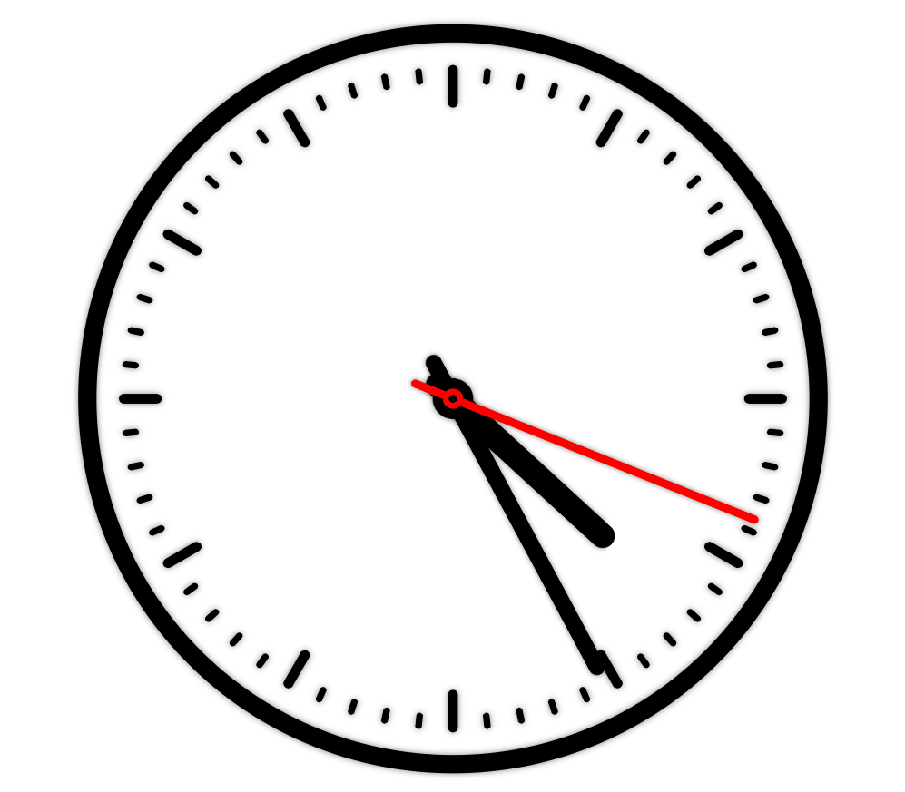

==============================
仕様をイメージしよう。
==============================

さぁ、構成を掴んだところで早速作業。の前にこれからどんな時計をどんな風に作っていくのかをイメージしておきましょう。特に今回はindex.htmlを開いたところで何も表示されませんから、何の事だかさっぱりですよね。

こんな機能で
==============================

普通のアナログ時計っぽい感じで時間以外の表示をしないシンプルなものにしたいと思います。ブラウザでindex.htmlを開くとそのまま自動で現在時刻を表示し、かつ表示を更新していきます。表示の更新間隔は今風のCPUの処理速度を鑑みそれなりの短さでいきましょう（目指すは1/60秒）。秒の表現は1秒ずつカチ、カチと刻むのではなくすーっと滑らかに動くものにしましょうか。

こんな見た目の
==============================

上記を踏まえて私が試作したSampleClockは右のような見た目になりました。 *OS X* 上の *Safari* で表示した際のスクリーンショットですが、他のブラウザでも大きな違いはないはずです。

特に見るべきところはありません。枠があって「時」、「分」刻みに印が打ってあって……。画像ではわかりませんが、実行開始時のブラウザの表示領域に合わせて大きさを調節するようにもなっています。もちろん見た目は自由にしていただいて構いません。線の太さや長さ、色などを適当に変更して自分好みの見た目に仕上げてください。

幾つかのパーツを組み合わせて（文字盤、短針など）描画しているのがおわかりだと思いますが、これらはいっさい画像を用いていません。 *Canvas* という *HTML5* に含まれる技術によって描かれています。 *Canvas* を操作するには、そう、 *JavaScript* を使います！
